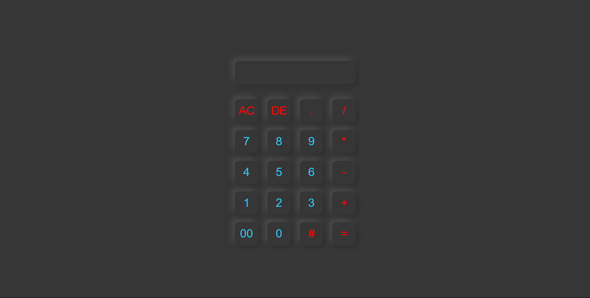

# Modern Calculator 🔢

A simple and stylish calculator built using HTML, CSS, and JavaScript.

## How to Run

1. Download all the files:
   - `index.html`
   - `style.css`
   - `output.png` for preview

2. Open `index.html` in any web browser.

3. Use the buttons to perform calculations.

## Features

- Basic arithmetic: +, –, ×, ÷
- Clear (`AC`) and Delete (`DE`) buttons
- Modern dark UI design

## Preview

---

Made for practice and fun.
